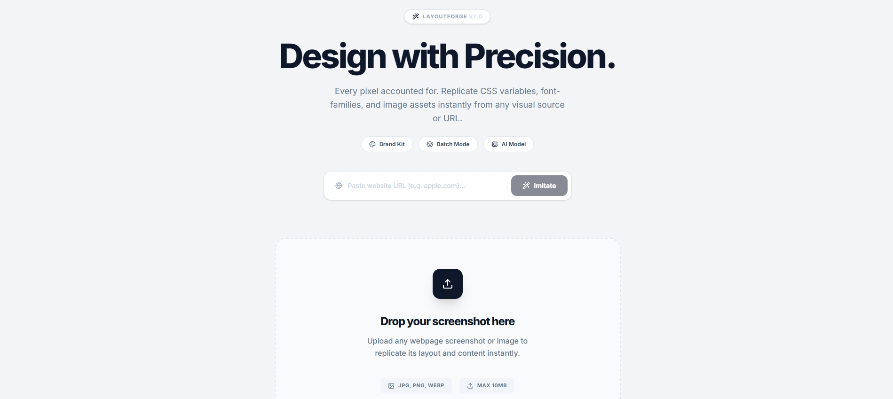

<div align="center">

</div>

# Layout Replicator
Layout Forge 是一个功能丰富、架构合理的AI网页布局复制工具。
> 上传截图或提供 URL，AI 自动将其复现为干净、可编辑的 HTML + Tailwind CSS 代码。

支持品牌定制、SEO 生成、无障碍检查、组件提取、批量处理以及基于聊天的优化面板。

---

## 功能特性

- **截图复现** — 上传任意网页截图，AI 自动分析布局、颜色、间距，生成语义化的 HTML + Tailwind CSS
- **URL 骨架提取** — 输入 URL，提取布局骨架，生成全新的模板（不复制原始内容）
- **品牌套件** — 定义品牌色、字体、Logo 等，AI 自动应用到生成的页面
- **组件提取** — 自动将生成的 HTML 拆分为可复用的组件（导航栏、英雄区、特性卡片等）
- **SEO 生成** — 基于页面内容自动生成 SEO 元标签
- **无障碍检查** — 审计页面无障碍问题并建议修复
- **聊天优化** — 通过对话式 AI 实时调整布局和样式
- **批量处理** — 一次上传多个截图，批量复制布局
- **设备预览** — 在桌面、平板和手机视图间切换
- **多格式导出** — 导出为 HTML、React、Vue 或 Next.js 代码

## 支持的 AI 提供商

| 提供商 | 环境变量 |
|---------|-----------|
| OpenAI | `OPENAI_API_KEY` |
| Anthropic | `ANTHROPIC_API_KEY` |
| Google Gemini | `GOOGLE_AI_API_KEY` |
| DeepSeek | `DEEPSEEK_API_KEY` |
| 通义千问 (Qwen) | `QWEN_API_KEY` |
| 智谱 GLM | `ZHIPU_API_KEY` |
| Groq | `GROQ_API_KEY` |
| 小米 MiMo | `MIMO_API_KEY` |
| 自定义 (OpenAI 兼容) | `AI_CUSTOM_API_KEY` + `AI_CUSTOM_BASE_URL` |

---

## 快速开始

### 前置要求

- Node.js >= 18

### 1. 克隆并安装

```bash
git clone <repo-url>
cd layout-replicator
npm install
```

### 2. 配置环境变量

复制环境变量模板并配置：

```bash
cp .env.example .env.local
```

编辑 `.env.local`，至少设置以下必填项：

```ini
AI_PROVIDER=mimo                          # 选择 AI 提供商
MIMO_API_KEY="your-api-key-here"          # 填入对应 API Key
```

> 所有可用的配置项请参考 [.env.example](.env.example)。

### 3. 运行

```bash
npm run dev
```

打开浏览器访问 **http://localhost:3000**

---

## 环境变量说明

| 变量 | 必填 | 说明 |
|------|------|------|
| `AI_PROVIDER` | 是 | 指定 AI 提供商 (openai, anthropic, google, deepseek, qwen, zhipu, groq, mimo, custom) |
| `AI_API_BASE_URL` | 否 | 通用 API 基地址覆写，可用于自定义网关或代理 |
| `AI_MODEL_TEXT` | 否 | 文本模型名称覆写 |
| `AI_MODEL_VISION` | 否 | 视觉模型名称覆写 |
| `{PROVIDER}_API_KEY` | 是 | 对应提供商的 API 密钥 |

---

## 项目结构

```
├── .env.local           # 本地环境配置（含密钥，已 gitignore）
├── .env.example         # 环境变量模板
├── server.ts            # Express 后端（AI 代理路由、缓存、URL 抓取）
├── vite.config.ts       # Vite 构建配置
├── src/
│   ├── App.tsx          # 主应用组件
│   ├── components/      # UI 组件
│   │   ├── UploadZone.tsx
│   │   ├── ResultView.tsx
│   │   ├── ChatPanel.tsx
│   │   ├── BrandKitPanel.tsx
│   │   ├── SEOPanel.tsx
│   │   └── ...
│   └── lib/
│       ├── providers.ts   # AI 提供商和模型定义
│       ├── brandKit.ts    # 品牌套件逻辑
│       ├── codeExporter.ts# 代码导出
│       └── ...
```

---

## 架构说明

- **前端**: React 19 + Vite 6 + Tailwind CSS v4
- **后端**: Express 4 (端口 3000)，通过 `tsx` 运行 TypeScript
- **AI 代理模式**: 浏览器不直接调用 AI 提供商，请求先发送到本地 Express 服务器，再由服务器转发到 AI 提供商。API 密钥保存在服务端。
- **缓存**: 非流式、非图片的 AI 请求会缓存 30 分钟（最多 50 条）。
- **限流**: AI 接口每 IP 每 60 秒限 20 次请求。
- **SSRF 防护**: MiMo API 地址仅限白名单域名。

---

## 许可证

MIT
